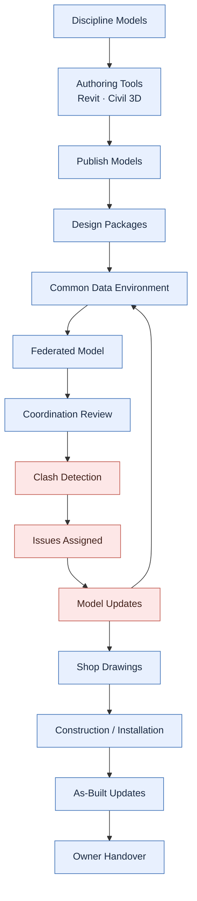

# CogStack BIM Coordination Workflow

A beginner-friendly educational repo explaining the **modern BIM coordination workflow**.

This repo covers how discipline models move from Revit, Civil 3D, and other authoring tools into a cloud coordination workflow, become part of a federated model, support clash detection, and eventually contribute to construction and owner handover.

---

## Core idea

**BIM coordination is not just clash detection.**

Clash detection is one important activity inside a much wider BIM coordination workflow. If you only learn clash detection, you miss most of what coordination actually does.

The full picture looks like this:

```
BIM Workflow
└─ BIM Coordination
   └─ Federated Models
      └─ MEP Coordination
         └─ Clash Detection
            └─ Issue Management
               └─ Model Updates
                  └─ Construction Support
                     └─ As-Built / Owner Handover
```

---

## The coordination workflow at a glance

The central teaching diagram — built as 3D geometry in Revit and modernized around a cloud **Common Data Environment**:


It flows left → right across **DESIGN → CONSTRUCTION → OPERATION**, with the blue **Common Data Environment (CDE)** running through the middle as the single source of truth. **Consultant models** (design) and **contractor models** (construction) both publish to it; two feedback loops — **RFI** and **ISSUES** — make coordination a cycle rather than a one-way pipeline.

### The six callouts

| # | Element | In one line |
|---|---|---|
| **1** | Coordinated Models | Design consultants' models brought together (design side) |
| **2** | Design Collaboration | Cloud workflow that publishes design models into the CDE |
| **3** | Common Data Environment | The cloud single source of truth — the spine |
| **4** | Contractor Models | Trade / fabrication models published into the CDE |
| **5** | Model Coordination | Cloud federation + automated clash detection |
| **6** | Federated Model | All models combined — used in construction, handed to operation |

Plus two loops: **RFI** (design questions → design changes) and **ISSUES** (clashes → model updates).

👉 **Full walkthrough:** [09 — The Coordination Workflow Diagram Explained](docs/09-coordination-workflow-diagram.md)

---

## Why BIM coordination matters

On a real project, many teams design at the same time: architects, structural engineers, mechanical, electrical, plumbing (MEP), fire protection, and civil/site. Each team builds its own 3D model.

Those models have to **fit together** in the same building. A duct cannot run through a beam. A pipe cannot pass through a doorway. Coordination is the process of bringing every discipline model into one shared space, checking that everything fits, resolving problems, and keeping the models updated as the design changes — all the way through construction and handover.

Done well, coordination prevents expensive surprises on site.

---

## Key distinctions

Beginners often mix these up. Here is the difference:

| Term | What it means |
|---|---|
| **BIM workflow** | The whole journey of model information, from design authoring to owner handover. |
| **BIM coordination** | Bringing discipline models together, reviewing them, and resolving conflicts across the project. |
| **MEP coordination** | Coordination focused on mechanical, electrical, plumbing (and fire) systems, which are especially conflict-prone. |
| **Clash detection** | One step inside coordination: automatically finding where elements physically conflict or violate clearances. |

---

## The flow as a simple chart

A lightweight, GitHub-native version of the same idea:



The source diagram lives in [`diagrams/simplified-bim-coordination-workflow.mmd`](diagrams/simplified-bim-coordination-workflow.mmd).

---

## Documentation

- [01 — BIM Workflow Overview](docs/01-bim-workflow-overview.md)
- [02 — Federated Models](docs/02-federated-models.md) *(coming soon)*
- [03 — MEP Coordination](docs/03-mep-coordination.md) *(coming soon)*
- [04 — Clash Detection](docs/04-clash-detection.md) *(coming soon)*
- [05 — Forma Model Coordination](docs/05-forma-model-coordination.md) *(coming soon)*
- [06 — Navisworks Workflow](docs/06-navisworks-workflow.md) *(coming soon)*
- [07 — Revit MCP Automation](docs/07-revit-mcp-automation.md) *(coming soon)*
- [08 — Revit 3D Workflow Diagram: Build Runbook](docs/08-revit-3d-workflow-diagram-plan.md)
- [09 — The Coordination Workflow Diagram Explained](docs/09-coordination-workflow-diagram.md)
- [Glossary](docs/glossary.md)

**Examples**
- [Harrismith Fire Station](examples/harrismith-fire-station/README.md) *(coming soon)*
- [BIM Clash Visual Atlas](examples/bim-clash-visual-atlas/README.md) *(coming soon)*

**Links**
- [Related CogStack repos](links/related-repos.md)
- [Learning resources](links/learning-resources.md) *(coming soon)*

---

## Roadmap

- **Phase 1 (done):** Foundation — README, overview doc, glossary, simplified diagram, related-repos links.
- **Phase 2 (in progress):** Deep content — complete topic docs 02–07 and detailed diagrams.
- **Phase 3:** Worked examples — Harrismith Fire Station, BIM Clash Visual Atlas.
- **Phase 4 (Module 00 built):** The workflow recreated as a 3D diagram in Revit via the pyRevit MCP server — see the [build runbook](docs/08-revit-3d-workflow-diagram-plan.md) and the [explained diagram](docs/09-coordination-workflow-diagram.md).

See [PRD.md](PRD.md) for the full product requirements.
