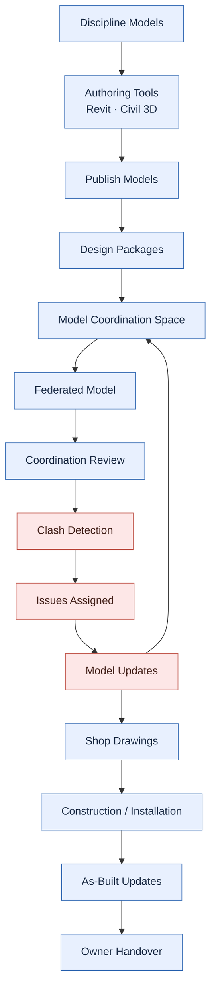

# CogStack BIM Coordination Workflow

A beginner-friendly educational repo explaining the **modern BIM coordination workflow**.

This repo covers how discipline models move from Revit, Civil 3D, and other authoring tools into a cloud coordination workflow, become part of a federated model, support clash detection, and eventually contribute to construction and owner handover.

---

## Core idea

**BIM coordination is not just clash detection.**

Clash detection is one important activity inside a much wider BIM coordination workflow. If you only learn clash detection, you miss most of what coordination actually does.

The full picture looks like this:

```
BIM Workflow
└─ BIM Coordination
   └─ Federated Models
      └─ MEP Coordination
         └─ Clash Detection
            └─ Issue Management
               └─ Model Updates
                  └─ Construction Support
                     └─ As-Built / Owner Handover
```

---

## Why BIM coordination matters

On a real project, many teams design at the same time: architects, structural engineers, mechanical, electrical, plumbing (MEP), fire protection, and civil/site. Each team builds its own 3D model.

Those models have to **fit together** in the same building. A duct cannot run through a beam. A pipe cannot pass through a doorway. Coordination is the process of bringing every discipline model into one shared space, checking that everything fits, resolving problems, and keeping the models updated as the design changes — all the way through construction and handover.

Done well, coordination prevents expensive surprises on site.

---

## Key distinctions

Beginners often mix these up. Here is the difference:

| Term | What it means |
|---|---|
| **BIM workflow** | The whole journey of model information, from design authoring to owner handover. |
| **BIM coordination** | Bringing discipline models together, reviewing them, and resolving conflicts across the project. |
| **MEP coordination** | Coordination focused on mechanical, electrical, plumbing (and fire) systems, which are especially conflict-prone. |
| **Clash detection** | One step inside coordination: automatically finding where elements physically conflict or violate clearances. |

---

## The workflow at a glance



The source diagram lives in [`diagrams/simplified-bim-coordination-workflow.mmd`](diagrams/simplified-bim-coordination-workflow.mmd).

---

## Workflow stages explained

1. **Discipline Models** — Each team owns its model (architecture, structure, MEP, fire, civil).
2. **Authoring Tools** — Models are created in tools like Revit and Civil 3D.
3. **Publish Models** — Teams publish their models to a shared cloud location.
4. **Design Packages** — Published models are organized into shareable packages.
5. **Model Coordination Space** — A cloud space where all discipline models come together.
6. **Federated Model** — All models combined into one coordinated view (without merging the originals).
7. **Coordination Review** — Teams review the federated model together.
8. **Clash Detection** — Automatic checks find physical conflicts and clearance problems.
9. **Issues Assigned** — Each clash or problem becomes an issue assigned to the responsible team.
10. **Model Updates** — Teams fix their models; updates flow back into the coordination space (the loop).
11. **Shop Drawings** — Coordinated models inform drawings used to fabricate and install.
12. **Construction / Installation** — The building is built from coordinated information.
13. **As-Built Updates** — Models are updated to reflect what was actually built.
14. **Owner Handover** — The final model and asset data are handed to the owner.

---

## Documentation

- [01 — BIM Workflow Overview](docs/01-bim-workflow-overview.md)
- [02 — Federated Models](docs/02-federated-models.md) *(coming soon)*
- [03 — MEP Coordination](docs/03-mep-coordination.md) *(coming soon)*
- [04 — Clash Detection](docs/04-clash-detection.md) *(coming soon)*
- [05 — Forma Model Coordination](docs/05-forma-model-coordination.md) *(coming soon)*
- [06 — Navisworks Workflow](docs/06-navisworks-workflow.md) *(coming soon)*
- [07 — Revit MCP Automation](docs/07-revit-mcp-automation.md) *(coming soon)*
- [08 — Revit 3D Workflow Diagram Plan](docs/08-revit-3d-workflow-diagram-plan.md)
- [Glossary](docs/glossary.md)

**Examples**
- [Harrismith Fire Station](examples/harrismith-fire-station/README.md) *(coming soon)*
- [BIM Clash Visual Atlas](examples/bim-clash-visual-atlas/README.md) *(coming soon)*

**Links**
- [Related CogStack repos](links/related-repos.md)
- [Learning resources](links/learning-resources.md) *(coming soon)*

---

## Roadmap

- **Phase 1 (now):** Foundation — README, overview doc, glossary, simplified diagram, related-repos links.
- **Phase 2:** Deep content — complete topic docs 02–07 and detailed diagrams.
- **Phase 3:** Worked examples — Harrismith Fire Station, BIM Clash Visual Atlas.
- **Phase 4 — Revit 3D workflow model:** Recreate this workflow as a colored **3D teaching diagram in Revit**, built later with the Revit MCP server. See the [plan](docs/08-revit-3d-workflow-diagram-plan.md).

See [PRD.md](PRD.md) for the full product requirements.
