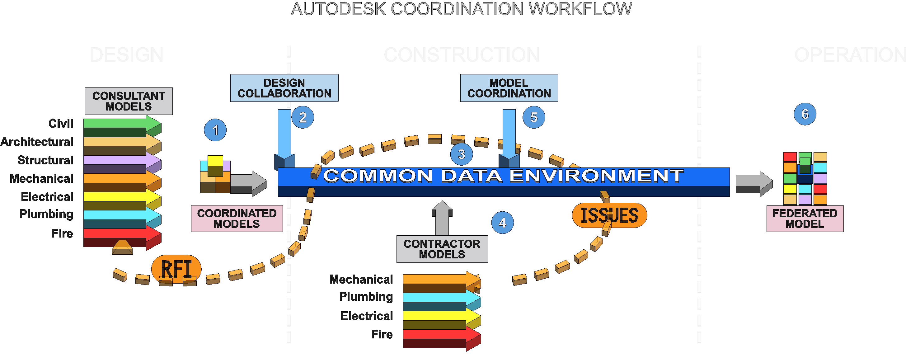

# CogStack BIM Coordination Workflow

This repo documents a modern **Autodesk-focused BIM coordination workflow** using Revit, Forma / ACC, Design Collaboration, Model Coordination, Navisworks, Issues, RFIs, and federated model handover.

## Purpose

The project explains how BIM coordination moves from static drawing handoff toward a **cloud-based, iterative coordination workflow**.

It uses a **Revit-generated 3D diagram** as the primary visual explanation:

> **Revit produces the diagram. Markdown explains the diagram. GitHub versions the learning system.**

---

## Main diagram



*Autodesk Coordination Workflow — Revit-generated 3D teaching diagram showing consultant models, contractor models, Design Collaboration, the Common Data Environment, Model Coordination, RFIs, Issues, and the Federated Model.*

Full explanation: **[docs/workflow-overview.md](docs/workflow-overview.md)**.

### Diagrams

- **BIM-001 — Autodesk Coordination Workflow / Overview** — `diagrams/revit/exports/ad-coordination-workflow-v05.png`
- BIM-002 — Coordination Feedback Loop *(planned as a separate export)*

---

## Core idea

**BIM coordination is not just clash detection.** Clash detection is one quality-control activity inside a much wider, iterative coordination workflow:

```
BIM Workflow
└─ BIM Coordination
   └─ Federated Models
      └─ MEP Coordination
         └─ Clash Detection
            └─ Issue Management
               └─ Model Updates
                  └─ Construction Support
                     └─ As-Built / Owner Handover
```

The **Common Data Environment (CDE)** is the backbone — the controlled place where information is shared, versioned, reviewed, routed, and recorded. But the CDE does not *fix* coordination problems: **people fix the source models**, then republish to the CDE and re-coordinate.

> **Find → Raise → Fix → Republish → Re-coordinate → Verify**

---

## Core concepts

- [Consultant Models & Coordinated Models](docs/callouts/01-coordinated-models.md)
- [Design Collaboration](docs/callouts/02-design-collaboration.md)
- [Common Data Environment](docs/callouts/03-common-data-environment.md)
- [Contractor / Trade Models](docs/callouts/04-contractor-trade-models.md)
- [Model Coordination](docs/callouts/05-model-coordination.md)
- [RFIs and Issues (feedback loops)](docs/coordination-feedback-loop.md)
- [Federated Model](docs/callouts/06-federated-model.md)
- [Construction vs Operations](docs/construction-vs-operations.md)

---

## Documentation

**Start here**
- [Documentation index](docs/index.md)
- [Workflow Overview (BIM-001)](docs/workflow-overview.md)
- [Coordination Feedback Loop](docs/coordination-feedback-loop.md)

**The six callouts**
- [01 — Coordinated Models](docs/callouts/01-coordinated-models.md)
- [02 — Design Collaboration](docs/callouts/02-design-collaboration.md)
- [03 — Common Data Environment](docs/callouts/03-common-data-environment.md)
- [04 — Contractor / Trade Models](docs/callouts/04-contractor-trade-models.md)
- [05 — Model Coordination](docs/callouts/05-model-coordination.md)
- [06 — Federated Model](docs/callouts/06-federated-model.md)

**Workflow topics**
- [Revit → Navisworks Workflow](docs/revit-to-navisworks-workflow.md)
- [Forma Model Coordination](docs/forma-model-coordination.md)
- [Construction vs Operations](docs/construction-vs-operations.md)
- [Versioning and Exports](docs/versioning-and-exports.md)
- [Non-Obvious Coordination Risks](docs/coordination-risks/non-obvious-clashes.md)

**Background & build**
- [BIM Workflow Overview](docs/01-bim-workflow-overview.md)
- [Glossary](docs/glossary.md)
- [Revit 3D Diagram Build Runbook](docs/08-revit-3d-workflow-diagram-plan.md) · [Build Prompt](docs/08-revit-build-prompt.md)
- [diagrams/revit — exports & versioning](diagrams/revit/README.md)

**Examples & links**
- [Harrismith Fire Station](examples/harrismith-fire-station/README.md) *(coming soon)* · [BIM Clash Visual Atlas](examples/bim-clash-visual-atlas/README.md) *(coming soon)*
- [Related CogStack repos](links/related-repos.md) · [Learning resources](links/learning-resources.md) *(coming soon)*

---

## Versioning strategy

- **Revit `.rvt`** = diagram authoring file (not committed to Git by default — binary, no useful diffs).
- **PNG / PDF exports** = version-controlled visual artifacts under `diagrams/revit/exports/`.
- **Markdown docs** = explanation / source of truth.
- **GitHub** = versioned educational repo / website source.

See [docs/versioning-and-exports.md](docs/versioning-and-exports.md). The source Revit model can be archived separately or managed with Git LFS later if needed.

---

## Roadmap

- **Phase 1 (done):** Foundation — repo scaffold, overview, glossary, first diagram.
- **Phase 2 (this update):** The Revit-generated PNG diagram becomes the primary educational artifact, explained in Markdown — the six callouts, feedback loops, Revit→Navisworks, Forma Model Coordination, Construction vs Operations, and non-obvious coordination risks.
- **Phase 3:** Worked examples — Harrismith Fire Station, BIM Clash Visual Atlas.

See [PRD.md](PRD.md) for the full product requirements.
