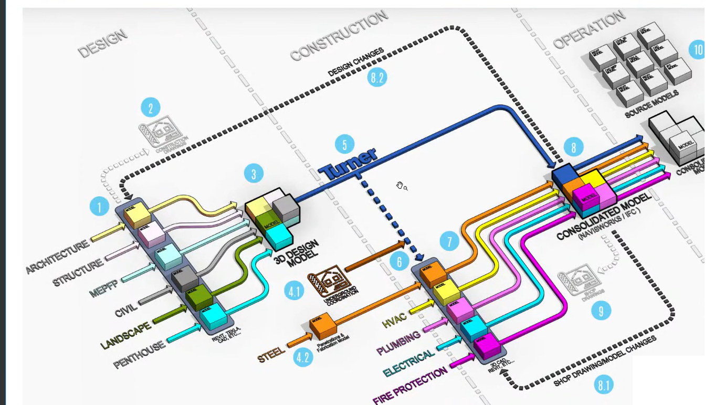

# Inspiration — Credit & Source

This folder holds the **third-party reference image** that inspired this project. It is **not** original work; it is included for educational reference, with credit.

*Original diagram by Jeffrey Pinheiro — The Revit Kid — from "3D Coordination Explained". It depicts a coordination workflow using Turner's White Plains Hospital [MOD IV] project as the worked example.*

| File | Source | Credit | Note |
|---|---|---|---|
| `revit-kid-bim-coordination-workflow-original.png` | Screenshot from The Revit Kid's YouTube video ["3D Coordination Explained"](https://www.youtube.com/watch?v=2JOGvY9YplY&t=2991s) (BIM After Dark series) | Diagram created by **Jeffrey Pinheiro — The Revit Kid** (depicting Turner's White Plains Hospital project as the example) | Screenshot cleaned (cropped; YouTube player chrome, presenter thumbnail, and like/comment icons removed). Educational use with attribution. A higher-resolution official copy may replace this if found. |

## Why it's here

This is the diagram that inspired the modernized [Autodesk Coordination Workflow](../revit/exports/ad-coordination-workflow-v06.png) built in this repo. The full personal account of how it was adapted and modernized is in the [README origin story](../../README.md#origin-story).

## Credits

- **Diagram by:** Jeffrey Pinheiro, *The Revit Kid* — from the video ["3D Coordination Explained"](https://www.youtube.com/watch?v=2JOGvY9YplY&t=2991s), part of the *BIM After Dark* series.
- **Example project depicted:** Turner's "BIM Coordination at White Plains Hospital [MOD IV]".

If you are a rights holder and would like attribution adjusted or the image removed, please open an issue.
