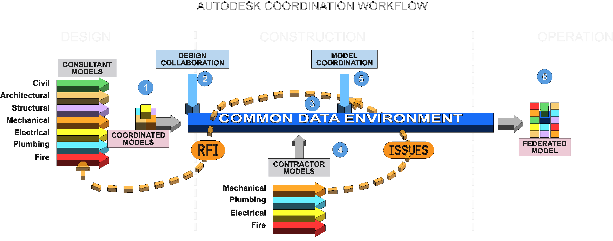

# Workflow Overview — Autodesk Coordination Workflow (BIM-001)

*Autodesk Coordination Workflow — a Revit-generated 3D teaching diagram showing consultant models, contractor models, Design Collaboration, the Common Data Environment, Model Coordination, RFIs, Issues, and the Federated Model.*

## What this diagram shows

The overview diagram shows how project information flows through a modern Autodesk coordination workflow. Consultant models are created during design, shared through **Design Collaboration**, managed in the **Common Data Environment**, checked through **Model Coordination**, and eventually contribute to a **Federated Model** that supports construction review, handover, and operations.

The **CDE is the backbone** of the workflow. It is not just a storage folder. It is the controlled environment where project information is shared, versioned, reviewed, routed, and acted on.

The diagram is intentionally simplified. It does not show every possible Autodesk tool or every possible project exchange. Its purpose is to explain the major coordination stations and the lifecycle movement from **design → construction → operation**.

The diagram was created in Revit as a conceptual 3D teaching diagram — it is **not a real building model** — and then exported as PNG for documentation. See [versioning and exports](versioning-and-exports.md) for how the diagram is published and version-controlled.

## The three lifecycle zones

| Zone | The question it asks |
|---|---|
| **Design** | What should we build? |
| **Construction** | How do we actually build it? |
| **Operation** | How do we run and maintain it after handover? |

See [Construction vs Operations](construction-vs-operations.md) for how the model's role changes across these phases.

## The six callouts

Each numbered callout has its own page:

1. [Coordinated Models](callouts/01-coordinated-models.md) — design discipline models brought together and checked for basic alignment.
2. [Design Collaboration](callouts/02-design-collaboration.md) — controlled, package-based sharing between consultant teams.
3. [Common Data Environment](callouts/03-common-data-environment.md) — the controlled information backbone of the project.
4. [Contractor / Trade Models](callouts/04-contractor-trade-models.md) — construction/fabrication models feeding coordination.
5. [Model Coordination](callouts/05-model-coordination.md) — checking shared models for clashes and coordination risks.
6. [Federated Model](callouts/06-federated-model.md) — the combined model set, the central object of coordination.

## It is an iterative workflow, not a one-way file transfer

The most important thing about this diagram: **coordination is a loop, not a pipeline.** Model Coordination finds problems; **people fix the source models**; the fixed models are republished to the CDE and re-coordinated until the problem is verified as resolved:

> **Find problem → Raise Issue or RFI → Assign responsibility → Update source model → Republish to CDE → Re-coordinate → Verify resolution**

The **RFI** and **ISSUES** loops in the diagram are what carry problems back to the model authors. This is explained in full in the [coordination feedback loop](coordination-feedback-loop.md).

## Why "Autodesk Coordination Workflow"?

The original contractor branding (from the well-known Turner / White Plains Hospital infographic) has been removed, but the title deliberately keeps *Autodesk*: the two cloud drivers in the diagram — **Design Collaboration** and **Model Coordination** — are Autodesk Forma products. That doesn't lock out open standards; models in **IFC** format (e.g. from Tekla) still interoperate. The point is that the *cloud coordination process itself* is Autodesk-driven.

## What happened to the General Contractor / Construction Manager?

In the older (pre-cloud) workflow, a GC or CM physically collected everyone's files, assembled them, and ran coordination. In this modernized workflow that role is largely **absorbed by the CDE plus the two Forma workflows** — Design Collaboration and Model Coordination. The GC/CM-led approach still happens in practice; it's just no longer the *spine* of the process.

---

*See also: [feedback loop](coordination-feedback-loop.md) · [Revit → Navisworks](revit-to-navisworks-workflow.md) · [Forma Model Coordination](forma-model-coordination.md) · [Glossary](glossary.md)*
