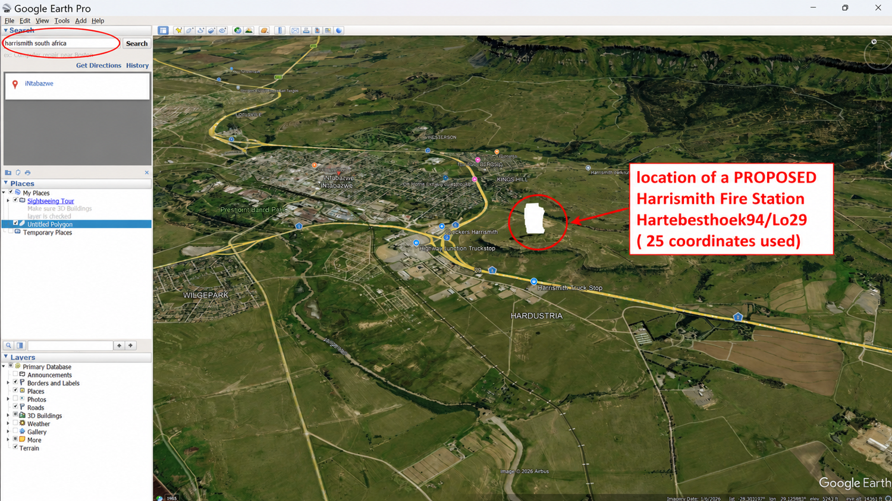
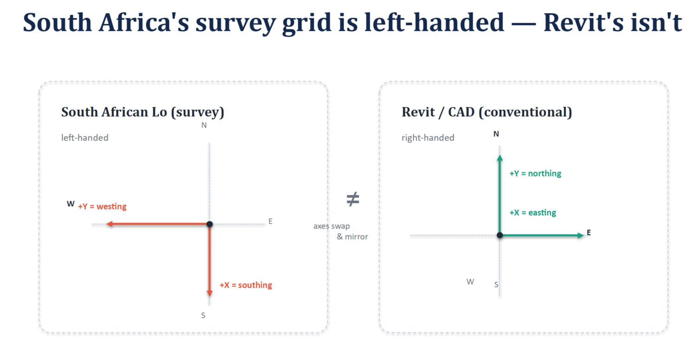
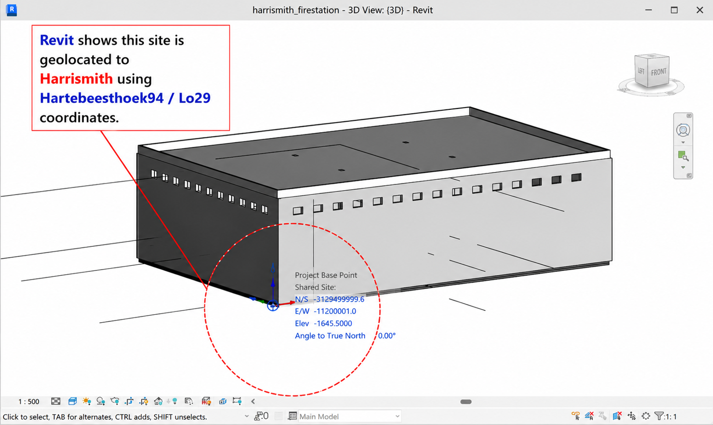
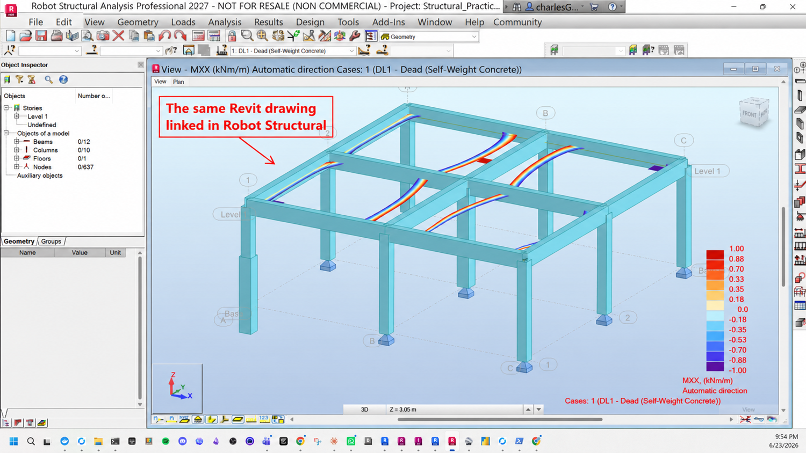
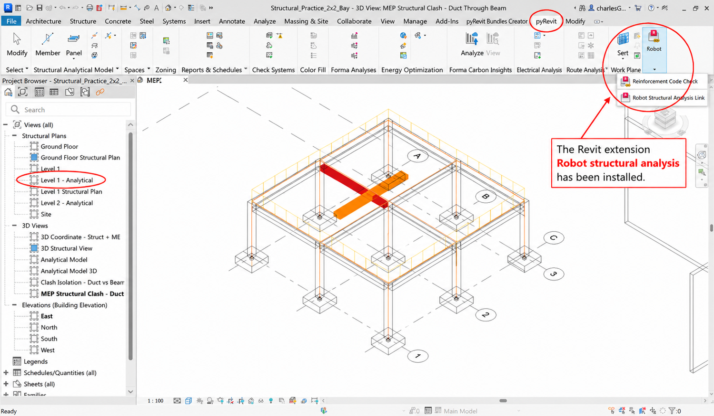
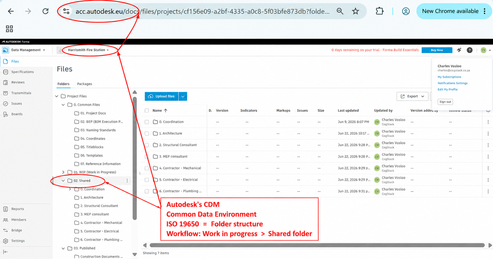
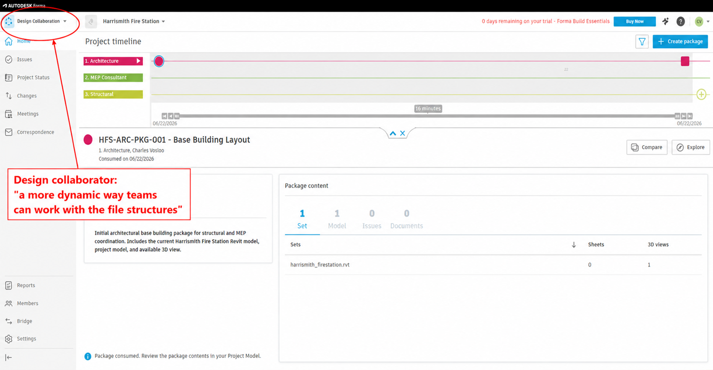

# Harrismith Fire Station — a worked example

*A real, still-in-progress project I'm using to walk the coordination workflow with actual tools rather than the abstract diagram. If the [BIM Workflow Guide](../../README.md) is the map, this is the territory.*

> **Status: in progress.** The project currently runs from civil survey coordinates through architecture, structure and MEP, and into cloud coordination in Forma — which is as far as I've taken it so far. It's a living example; the construction and operation stages aren't here yet.

> 🖼️ Screenshots are from the Harrismith pilot (via the Triviron BIM workflow deck). A couple of slots — a standalone MEP view — are still open.

## The journey

The Harrismith model moves through one tool at a time, and each step lands somewhere on the guide's diagram.

### 1. Civil — establishing the coordinates

Everything downstream has to sit in the same place in space, so the project starts on the ground: the survey and civil setup (Civil 3D) that fixes the shared coordinate system — the base point every later model inherits. Get this wrong and every discipline is subtly misplaced. On the diagram it's the groundwork beneath [Consultant Models ①](../../README.md#1-coordinated-models).

*The real site — a proposed fire station near Harrismith, located from 25 survey points on the South African Lo29 grid (Hartebeesthoek94).*

*A South-African wrinkle worth its own note: the Lo survey grid is left-handed while Revit/CAD is right-handed. Getting that flip right is what keeps the model on the correct spot on Earth.*

→ **Drill-down:** [how Revit geolocates onto the Civil 3D survey (shared coordinates)](shared-coordinates.md).

### 2. Architecture — the Revit model

The architectural model is authored in Revit on those coordinates, and becomes the first shape of the building the other disciplines design against. On the diagram it's a [Consultant Model ①](../../README.md#1-coordinated-models), shared through [Design Collaboration ②](../../README.md#2-design-collaboration).

*The building geolocated in Revit to the exact Harrismith position — project base point and angle to true north taken from the survey coordinates.*

### 3. Structure — Revit ↔ Robot Structural Analysis

The structural model round-trips between Revit and Autodesk Robot Structural Analysis: Revit for the physical model, Robot for the analysis and design, then back into a coordinated structural model. On the diagram, another [Consultant Model ①](../../README.md#1-coordinated-models).

*The same Revit structural model linked straight into Autodesk Robot for analysis — one model, analysed in place, results flowing back.*

### 4. MEP — services in Revit

Mechanical, electrical, plumbing and fire services modelled in Revit and threaded through the architecture and structure — the systems most likely to fight each other for space. Still [Consultant Models ①](../../README.md#1-coordinated-models) here; the same trades become [Contractor / Trade Models ④](../../README.md#4-contractor-and-trade-models) downstream.

> 📷 *Slot still open — a standalone MEP view. For now the services show up alongside structure in the coordination clash below.*

### 5. Coordination — Navisworks

The discipline models are federated and clash-tested on the desktop — the first moment structure and MEP are actually forced to agree. This is [Model Coordination ⑤](../../README.md#5-model-coordination), desktop side.

*The clash that proves the point: a service duct running straight through a structural beam, caught in coordination on screen — long before it could become rework on site.*

### 6. Cloud coordination — Forma — *current frontier*

The models are published into Autodesk Forma, where **Design Collaboration** handles sharing and **Model Coordination** handles cloud clash detection — the blue spine of the diagram. On the guide, this is the [Common Data Environment ③](../../README.md#3-common-data-environment) with [Design Collaboration ②](../../README.md#2-design-collaboration) and [Model Coordination ⑤](../../README.md#5-model-coordination). **This is as far as the project has gone so far.**

*The Common Data Environment in Autodesk Forma, organised to ISO 19650 / SANS 19650 — Work in Progress → Shared → Published.*

That folder structure isn't arbitrary — it follows ISO 19650 (and its South African adoption, SANS 19650), the standard for managing information in a CDE. Work moves through three states as it matures: **Work in Progress**, each discipline's own unshared working area; **Shared**, checked and released for the other disciplines to coordinate against; and **Published**, formally approved and issued as the authoritative copy. Structured this way, Forma keeps one version of the truth and stays audit-ready — which matters for a public building like a fire station.

*Design Collaboration in Forma — each discipline publishing and consuming coordinated packages on a shared timeline.*

## Where it goes next

Not reached yet: contractor and trade models, shop drawings, installation and sequencing, as-built records, and eventual handover into operations — the right-hand side of the diagram. See [Construction vs Operations](../../README.md#construction-vs-operations).

## At a glance

| Harrismith stage | Tool | On the guide |
|---|---|---|
| Coordinates | Civil 3D / survey | groundwork under ① |
| Architecture | Revit | ① → ② |
| Structure | Revit ↔ Robot | ① |
| MEP | Revit | ① / ④ |
| Coordination | Navisworks | ⑤ (desktop) |
| Cloud coordination | Forma | ③ + ② + ⑤ ← *here now* |

---

*Companion to the [BIM Workflow Guide](../../README.md).*
