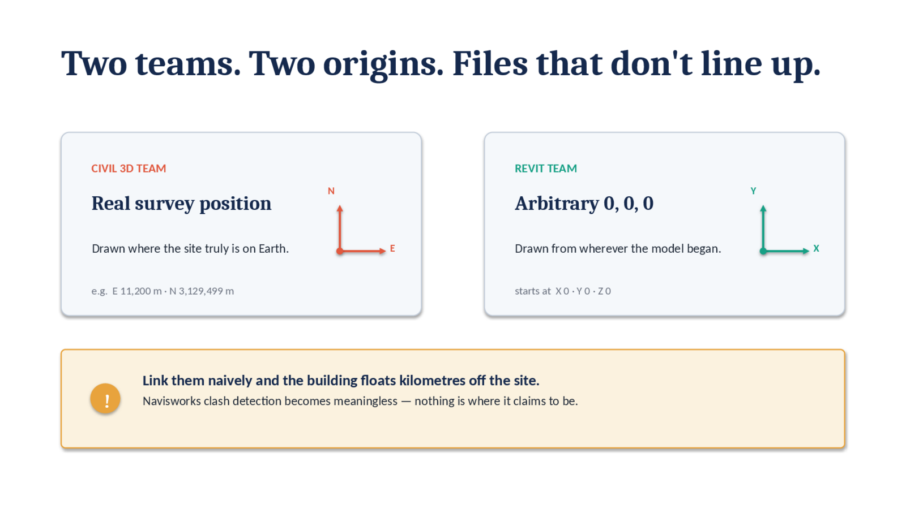
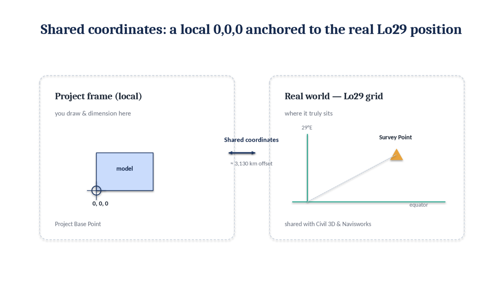
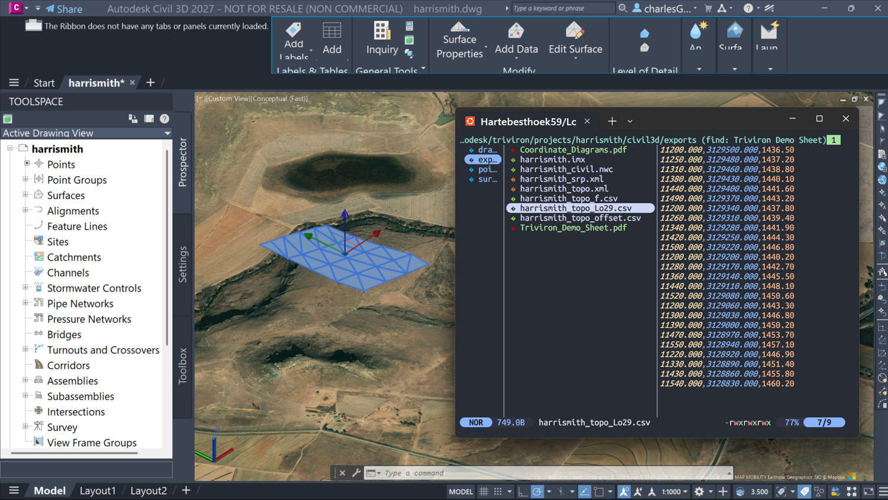
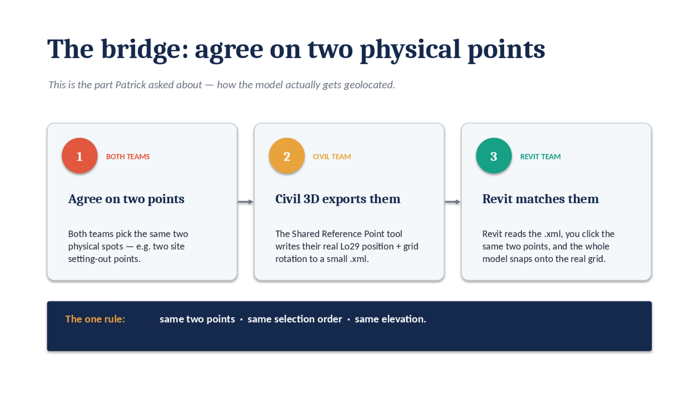
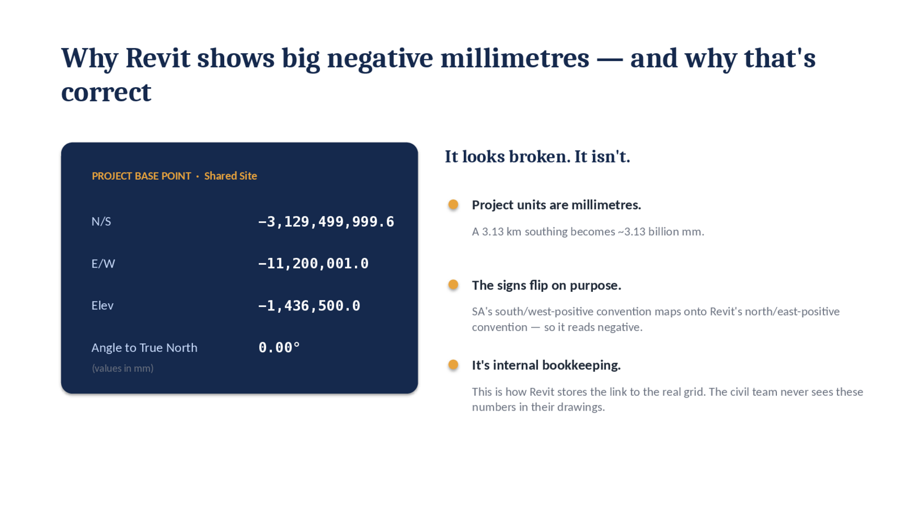
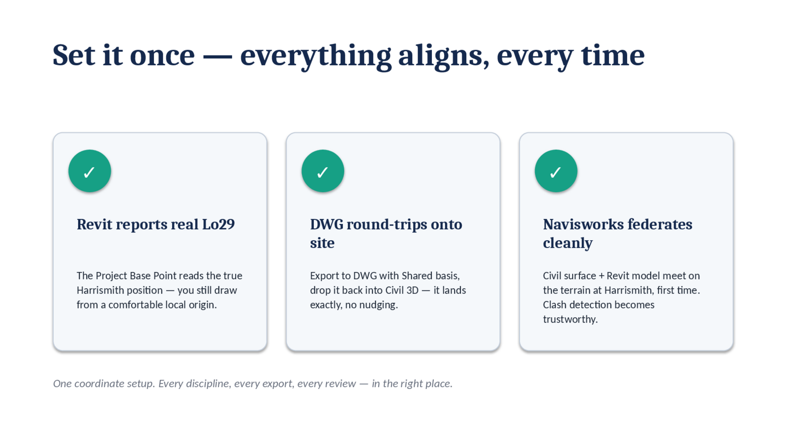

# Shared Coordinates — how Revit geolocates onto the Civil 3D survey

A drill-down from the [Harrismith worked example](README.md): the question everyone eventually asks — *how does the Revit model end up sitting on the real site, in the South African survey system, lined up with the civil team's drawing?* The answer is **shared coordinates**, the bridge between Civil 3D and Revit. Here it is worked through on Harrismith (Hartebeesthoek94 / Lo29, EPSG:2053).

## Two teams, two origins

The civil team draws at the **real survey position** — the site's true place on Earth (roughly E 11,200 m, N 3,129,499 m on Lo29). The Revit team starts at an **arbitrary 0, 0, 0**, wherever the model happened to begin. Link the two files naively and the building floats kilometres off the site — and Navisworks clash detection becomes meaningless, because nothing is where it claims to be.

## The South African wrinkle: a left-handed grid

South Africa's Lo survey grid is **left-handed**: positive X is *southing*, positive Y is *westing*. Revit and CAD are **right-handed**: positive X is easting, positive Y is northing. The axes swap *and* mirror, so the flip alone — if you get it wrong — lands the building in the wrong place.

## Shared coordinates: a local origin anchored to the real world

The fix is to keep drawing and dimensioning around a comfortable local **0, 0, 0** (the **Project Base Point**), while that local frame is anchored to the true Lo29 position through the **Survey Point** — an offset of roughly 3,130 km that Revit carries in the background and shares with Civil 3D and Navisworks. You get a convenient origin to work in *and* a model that knows where it really is.

## The 25 coordinates, in Civil 3D

On Harrismith the survey gives **25 points** on the Lo29 grid — the real setting-out of the site, held in Civil 3D. These are the ground truth everything else has to agree with.

## The bridge: agree on two physical points

This is the part that actually geolocates the model — and the step most people are unsure about:

1. **Both teams agree on the same two physical points** — for example two site setting-out points.
2. **The civil team exports them.** Civil 3D's *Shared Reference Point* tool writes their real Lo29 position and grid rotation into a small `.xml`.
3. **Revit matches them.** It reads the `.xml`, and the whole model snaps onto the real grid.

The one rule: **the same two points, selected in the same order, at the same elevation.**

## Why Revit then shows huge negative millimetres — and why that's correct

Open the Project Base Point afterwards and you'll see values like N/S −3,129,499,999.6, E/W −11,200,001.0 (millimetres). It looks broken; it isn't. Project units are millimetres, so a 3.13 km southing becomes about 3.13 *billion* mm. The signs flip on purpose — South Africa's south/west-positive convention maps onto Revit's north/east-positive one. It's internal bookkeeping; the civil team never sees these numbers in their drawings.

## Set it once — everything aligns

Do it once and it holds. Revit reports the real Lo29 position while you still draw from a comfortable local origin. Export to DWG on the shared basis and it drops straight back into Civil 3D — no nudging. And Navisworks federates the civil surface and the Revit model on the terrain at Harrismith, so clash detection is finally trustworthy.

---

*Companion to the [Harrismith worked example](README.md) and the [BIM Workflow Guide](../../README.md).*
